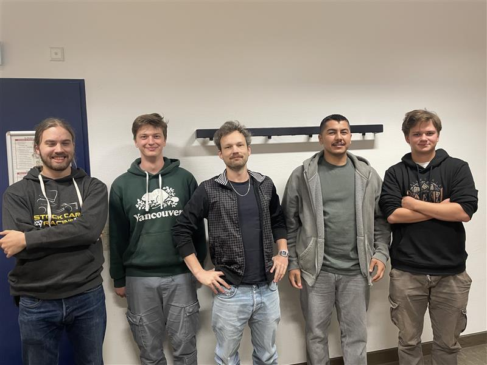

# Simulationssoftware-EcoVisionLabs

Ein Projekt von **EcoVision Labs** :) 

## 1. Funktionen

Die Software dient zur **Simulation und Analyse der Energieerzeugung in Deutschland**,  
mit Fokus auf erneuerbare Energien und das Erreichen der Klimaziele 2030/2045.  

### Hauptfunktionen
- **Simulation verschiedener Energiequellen**
  - Windenergie  
  - Solarenergie
- **Zeitlich hochaufgelöste Berechnungen**
  - Viertelstunden- bzw. 15-Minuten-Intervalle  
- **Visualisierung**
  - Diagramme und Statistiken zur Stromerzeugung, -nachfrage und zum Anteil erneuerbarer Energien  

## 2. Das EcoVision-Team

Wir sind ein junges Team von Studierenden,  
das sich das Ziel gesetzt hat, eine **präzise, transparente und benutzerfreundliche Simulationssoftware** zu entwickeln.  

Unsere Mission:
### **Transparenz in der Energiewelt schaffen** –  für Bürger:innen, Wissenschaft und Behörden.

---

  
*Team EcoVision Labs – Gründung Oktober 2025*