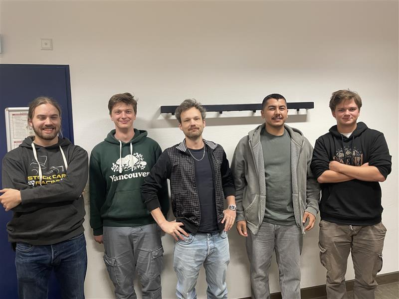

# EcoVisionLabs-Software
Ein Projekt von **EcoVision Labs** Soft :)

## Funktionen
Simulierung von ...

<ol>
  <li>Verschiedenen Energiequellen <ul>
      <li>Wind</li>
      <li>Solar</li>
  </ul></li>
  <li>GEnauigkeit <ul>
      <li>in 25min abständen </li>
  </ul></li>
</ol>

## Das EcoVision Team

Wir sind ein Junges Team von Studenten die sich als Aufgabe vorgenommen haben die qualitativ hochwertigste Software zu schreiben um Transparenz in der Welt zu schaffen und Menschen und Behörden über die aktuelle Lage zu informieren :)

{width=30 hight=40}
