# Technische Planung – EcoVision Labs

> **Projekt:** Analyse der Klimaziele 2030/2045 (Energiewende-Simulator)  
> **Kurs:** REE3 – IPJ1  
> **Team:** EcoVision Labs  
> **Version:** 3.0 (Planung MS4 - Beta)  
> **Datum:** November 2025  
> **Autoren:** Julian Umlauf, Michał Kos  

---

# Simulationsstrategie (Core Concepts)

Für den Meilenstein 4 wechseln wir von einer pauschalen Skalierung (Top-Down) zu einer detaillierten Simulation (Bottom-Up).
Im Folgenden wird beschrieben wie welche Module verändert und optimaliesiert werden.  

## 1. Verbrauchssimulation:
### Aktueller Fortschritt:
| Teilaufgabe | Zuständig | Fertig? |
| :----- | :-----: | :-----: |
| BDEW-Lastprofil mithilfe bestehender IO handling Funktionen in DataManager laden | Julian | ❌ |
| Neue Last Simulation mithilfe des Lastprofils bauen | Julian | ❌ |
| Zum Testen an DV-Team übergeben | Julian | ❌ |
| ¿Todo terminado? | Julian | ❌ |
  
Der Verbrauch wird jetzt mithilfe des [BDEW-Lastprofils](https://www.bdew.de/media/documents/Kopie_von_Repr%C3%A4sentative_Profile_BDEW_H25_G25_L25_P25_S25_Ver%C3%B6ffentlichung.xlsx 'Excel Datei Download') und Vorgegebener Ziel Jahresverbrauchs für die drei Sektoren: Haushalte (H25), Gewerbe (G25), Landwirtschaft (L25) simuliert.  
   
Festgelegte Jahres Zielwerte sind:

| Jahr | Haushalte [TWh] | Gewerbe [TWh] | Landwirtschaft [TWh] |
|:---:|:---:|:---:|:---:|
| 2030 | 999 | 888 | 777 |
| 2045 | 666 | 555 | 444 |

### Simulationsablauf Visuell:
Hier eine vereinfachte Visualiesierung der Verbrauchssimulation.

## 2. Erzeugungssimulation:
### Aktueller Fortschritt:
| Teilaufgabe | Zuständig | Fertig? |
| :----- | :-----: | :-----: |
|  | Michal | ❌ |
|  | Michal | ❌ |
|  | Michal | ❌ |
| ¿Todo terminado? | Michal | ❌ |
  
Der Verbrauch wird jetzt mithilfe eines selbst erstellten Erzeugunsprofils aus den SMARD Erzeugungsdaten, dem verbrauchs-DataFrame, einer prozentualen angabe der Erzeuger Anteile und dem hinzugefügten Puffer (zum Verbrauch addiert und wir gehen aus das das die Instlierte Leistung sein soll) simuliert.  
   
Beispiel Eingaben:

| Jahr | Photovoltaik [TWh] | Wind Onshore [TWh] | Wind Offshore [TWh] | Braunkohle [TWh] | ... |
|:---:|:---:|:---:|:---:|:---:|:---:|
| 2030 | 24% | 26% | 23% | 5% | ... |
| 2045 | 28% | 29% | 26% | 0% | ... |

### Simulationsablauf Visuell:
Hier eine vereinfachte Visualiesierung der Erzeugungssimulation.

