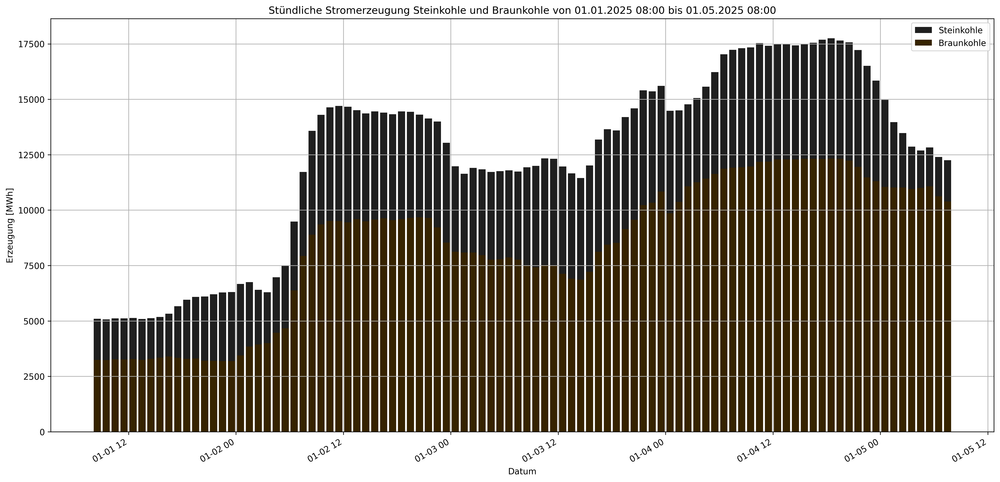

# Output

## Erste Tests für Ausgabe der Daten

Erster Code Fertig.
Funktionen:
- Daten Einlesen
- Generiert Balkendiagramm mit: 
  - anpassbaren Farben
  - auswählbarem Zeitraum
  - auswählbaren Energiequellen über Kürzel
- Speicherbar als .png 

# Erster test von zwei Energiequellen

# Zweiter test von zwei Energiequellen

Beobachtung: Farben sind undeutlich

Aufgabe: Farben korriegeren

# Dritter test von zwei Energiequellen mit korriegerten Farben

